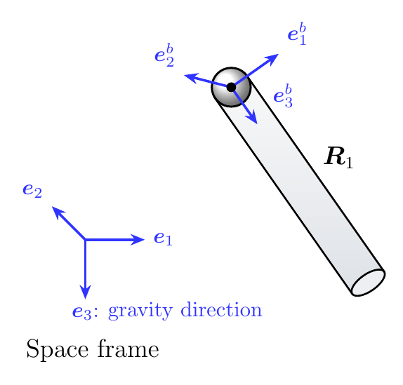
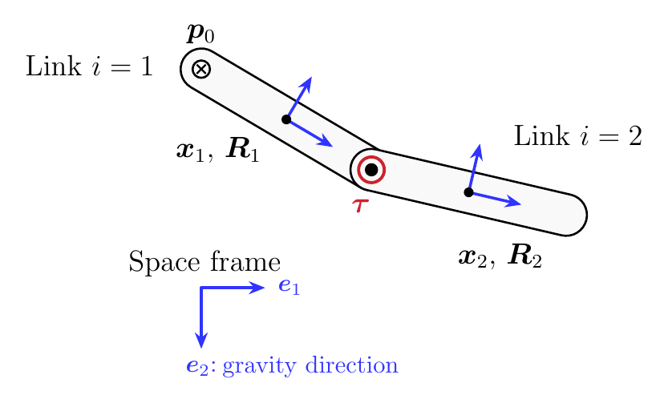
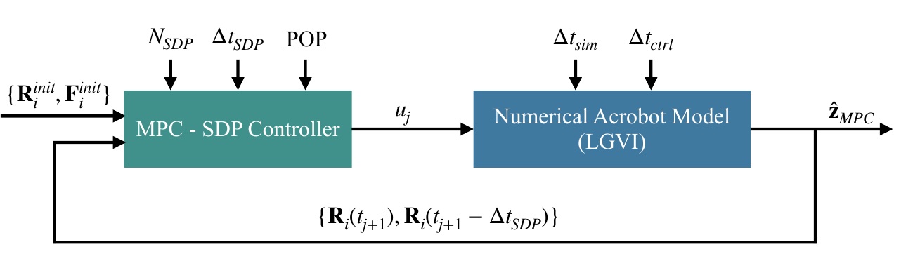
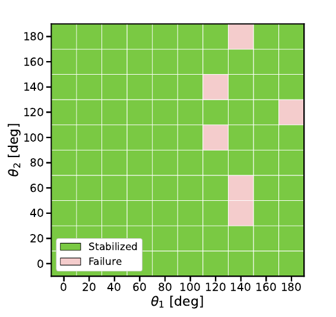
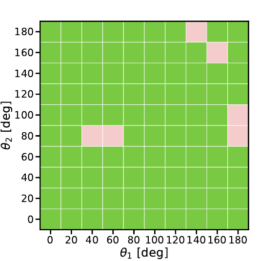
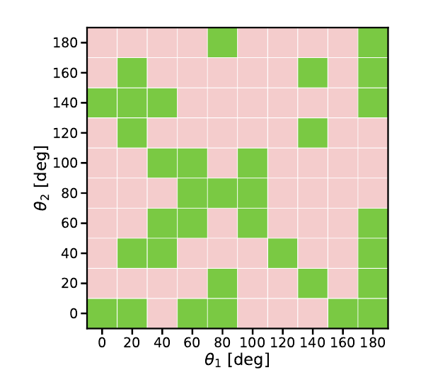
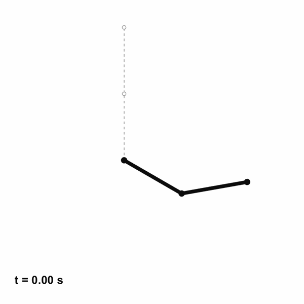
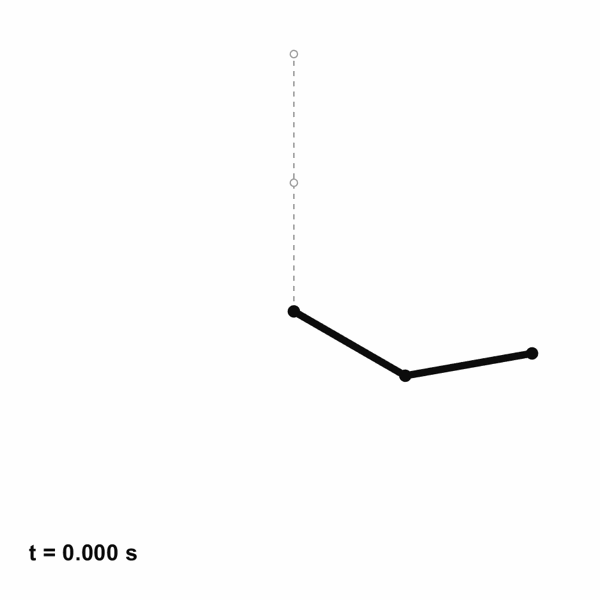

# Certifiable Trajectory Optimization for Rigid-Body Systems on Lie Groups

Planning rigid-body motion is difficult because nonlinear dynamics and rotation constraints make trajectory optimization nonconvex. This project studies how to preserve the mechanics and certify a globally optimal trajectory when the optimization relaxation is tight.

## Method

The benchmarks are a 3D pendulum on $\mathrm{SO}(3)$ and an underactuated Acrobot on $\mathrm{SO}(2)\times\mathrm{SO}(2)$. Lie group variational integrators (LGVIs) give structure-preserving discrete dynamics; maximal coordinates keep the Acrobot model quadratic. The resulting polynomial trajectory problems are solved with sparse, second-order Moment-SOS semidefinite relaxations using [SPOT](https://github.com/ComputationalRobotics/SPOT). A feasible extracted trajectory whose cost matches the SDP lower bound certifies global optimality.

| 3D pendulum | Acrobot |
| :---: | :---: |
| [](pics/3d_pendulum_so3.pdf) | [](pics/acrobot_so2.pdf) |

For harder Acrobot swing-ups, the SDP is used in model predictive control (MPC): extract the first control, advance the numerical Acrobot with an LGVI, and solve again from the new state.

[](pics/MPC.pdf)

## Results

### 3D pendulum

All five tested target rotations yielded feasible, numerically rank-one trajectory extractions with costs matching their SDP lower bounds, including the 180 deg maneuver shown below.


### Acrobot MPC

With a 15 Nm torque bound, the empirical basins below sample 100 pairs of initial link angles. Matched prediction, simulation, and control time steps stabilized **94/100** starts in both Cases I and II; the mismatched steps in Case III stabilized **34/100**. These closed-loop trajectories are feasible in simulation, but are not globally certified.

| | Case I | Case II | Case III |
| :--- | :---: | :---: | :---: |
| Prediction / simulation / control step (s) | 0.1 / 0.1 / 0.1 | 0.05 / 0.05 / 0.05 | 0.1 / 0.0025 / 0.025 |
| Stabilized starts | 94/100 | 94/100 | 34/100 |
| Basin of attraction | [](pics/basin_case_I.pdf) | [](pics/basin_case_II.pdf) | [](pics/basin_case_III.pdf) |

| Acrobot swing-up to 180 deg | Second 180 deg swing-up illustration |
| :---: | :---: |
|  |  |

## Run the code

Install the Python packages for the numerical simulations, then run these scripts from the repository root:

```bash
python -m pip install numpy scipy matplotlib pyyaml
python Numerical_Simulation/main_numerical_simulation.py
python Numerical_Simulation/Acrobot/main_acrobot_unforced.py
python Numerical_Simulation/Acrobot/main_acrobot_forced_sine.py
```

The optimization scripts additionally require [SPOT](https://github.com/ComputationalRobotics/SPOT) and its solver dependencies, including MOSEK. Follow SPOT's Python setup, then copy `Ridged_Body_SDP/pendulum_SO3_Python.py` and the entire `Ridged_Body_SDP/acrobot_SO2_python/` directory into SPOT's `Python-examples/`. From the SPOT repository root, run:

```bash
python Python-examples/pendulum_SO3_Python.py
python Python-examples/acrobot_SO2_python/open_loop_sdp.py
python Python-examples/acrobot_SO2_python/main_sdp_mpc.py
```

Edit `Python-examples/acrobot_SO2_python/config/acrobot_physical.yaml` to choose the initial state, time steps, horizon, and torque bound. The MPC entry point runs one initial state per invocation; the basin plots summarize the thesis's 100-start evaluations.

## Thesis and slides

[Master's thesis](Edonis_Elshani_Master_Thesis_Final.pdf) | [Presentation slides](Master_Presentation_Slides.pdf)
